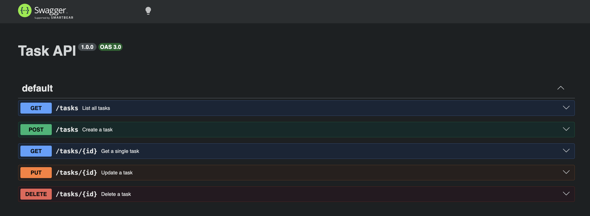

# Task API

A small in-memory to-do list API built with Node.js and Express. Supports full CRUD (Create, Read, Update, Delete) on tasks, with interactive documentation via Swagger UI.

Data lives only in memory — it resets whenever the server restarts. There's no database yet; that's next week's topic.

## How to run it

```bash
npm install
node server.js
```

Server runs at **http://localhost:3000**
Interactive docs (Swagger UI) at **http://localhost:3000/docs**

## Endpoints

| Method | Path         | Description                          | Success | Errors |
|--------|--------------|---------------------------------------|---------|--------|
| GET    | `/`          | API description                       | 200     | —      |
| GET    | `/health`    | Health check                          | 200     | —      |
| GET    | `/tasks`     | List all tasks                        | 200     | —      |
| GET    | `/tasks/:id` | Get a single task                     | 200     | 404    |
| POST   | `/tasks`     | Create a task (`{ "title": "..." }`)  | 201     | 400    |
| PUT    | `/tasks/:id` | Update `title` and/or `done`          | 200     | 400, 404 |
| DELETE | `/tasks/:id` | Delete a task                         | 204     | 404    |

## Sample request

```
$ curl -i -X POST http://localhost:3000/tasks -H "Content-Type: application/json" -d '{"title":"Buy milk"}'
HTTP/1.1 201 Created
Content-Type: application/json; charset=utf-8

{"id":4,"title":"Buy milk","done":false}
```

## Swagger UI

`/docs` lists every endpoint as interactive documentation — each one can be expanded and run directly from the browser with "Try it out."



## Notes

Restarting the server resets the task list back to the 3 seed tasks — everything is stored in a plain in-memory array, so nothing persists once the process stops. That's expected at this stage; a real database (coming next week) is what fixes it.
